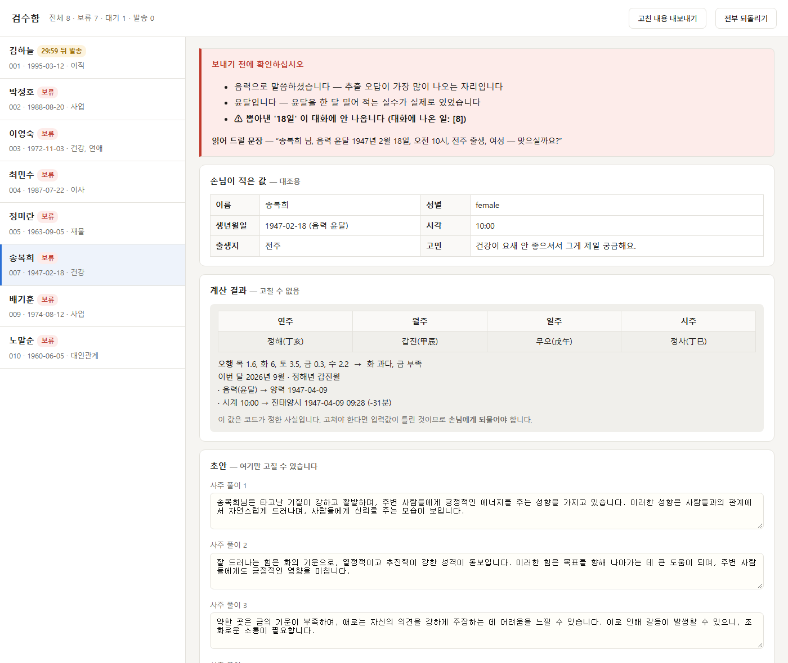
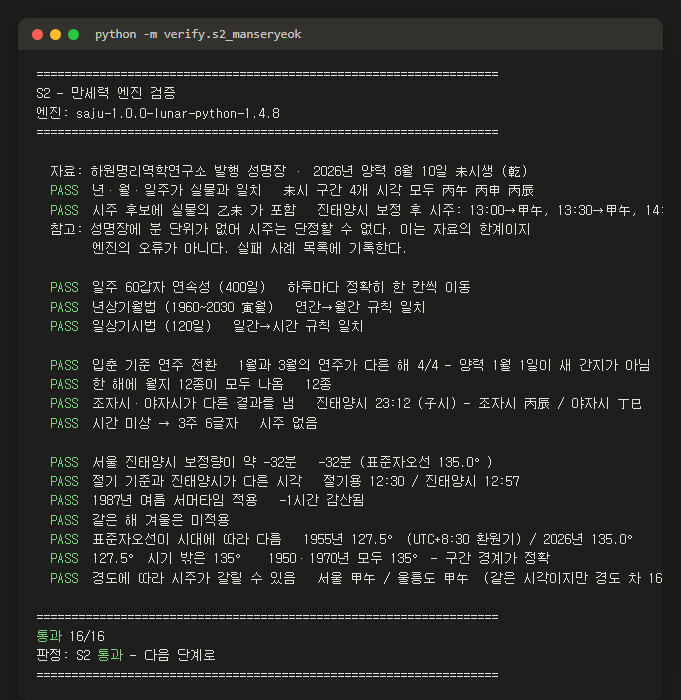
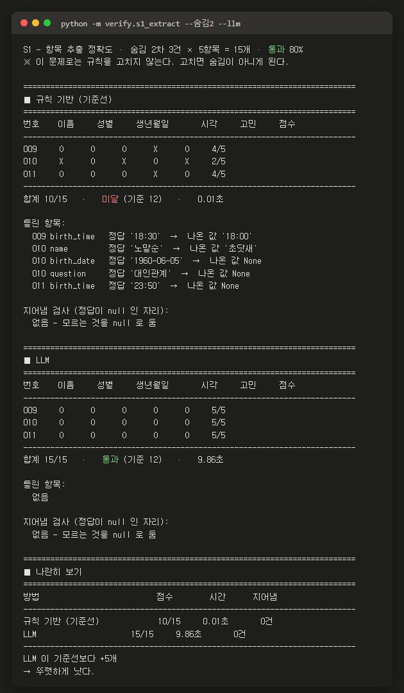
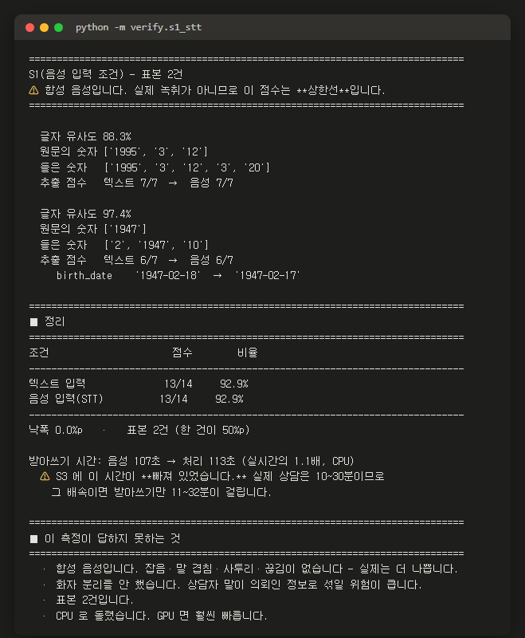

# 사주 상담 접수·리포트 초안 자동화 — PoC

> **Main Quest 2** 「내 도메인에서 AI로 개선 지점 찾아서 PoC 만들기」

상담 녹취(음성)를 받아 사주 리포트 초안까지 **명령 한 줄로** 만드는 것을 목표로 하는 개념 검증입니다.

```
상담 녹취 → [Whisper STT] → 텍스트 → [LLM 추출] → 생년월일시
         → [만세력 엔진] → 원국·세운 → [LLM] → 리포트 초안
```

**계산은 코드가, 문장은 AI가.** 만세력·보정 계산은 AI에 맡기지 않습니다.

---

## 지금 상태

> 2026-09-22 외부 검토(Genspark)를 받고 **21건을 반영**했습니다. 그 과정에서
> **"100%" 가 채점 범위가 좁아서 나온 값**임이 드러나 **95% 로 정정**했습니다.
> 대응 내역은 `docs/검토대응.md`.

| 기준 | 상태 | 값 |
|---|---|---|
| **S1** 항목 추출 | 측정·달성 | 검증셋2 LLM **20/21** · 기준선 16/21 — **텍스트 입력 조건** |
| **S2** 만세력 | 측정·달성 | **17/17** · 경계 커버리지 **10/10** |
| S3 처리 시간 | **미측정** | 분모(수작업)가 가정값 · ① 받아쓰기 미포함 |
| **S4a** 코드 결정성 | 측정·달성 | **8표본 × 20회 전부 동일 (100%)** |
| S4b 추출 재현성 | **측정·미달** | LLM 95.2% — 확인 게이트로 완화 |
| S5 초안 품질 | **미측정** | 평가자 2명 필요 |
| **S6** 원가 | 측정·참고 | 건당 약 **0.9~1.1원** (⚠ 단가 미확인) |

**검사 건전성** — 변이 시험 **57/57 유효** · 상수 조건 **0곳** · 전칭 양화 미등록 **0곳** · 경계 커버리지 **10/10**

⚠ **표본 수와 항목 수는 다릅니다.** `20/21` 은 표본 **3건** × 7항목입니다.
한 건이 어긋나면 **33%p** 움직입니다. 그리고 **아직 아무도 안 본 잠금 시험셋이 없어서**,
이 숫자는 전부 "검증셋 성적"입니다.

---|---|
| 문제 정의 | ✅ `문제정의서.md` |
| 구현 명세 | ✅ `PRD_PoC.md` |
| **S2 만세력 검증** | ✅ **통과 17/17** — 허수 검사 1개를 진짜 검사로 교체 |
| **S1 항목 추출** | ✅ **통과** — 숨김 2차 LLM **15/15**, 기준선 10/15 |
| **파이프라인 ①~⑦** | ✅ 연결됨 — `poc/pipeline.py`, 4건 실행 완료 |
| S3 처리 시간 | ⚠ **가정 기반 4.3배 · 미달** — 분모(수작업 시간) 미실측 |
| S4 재현성 | ❌ **미달** — LLM 95.2%, 사람 확인 화면 필요 |
| S5 초안 품질 | ⏳ **다음 차례** — S3 의 판정이 여기에 달림 |

---

## 실행 방법

### 준비

```bash
pip install -r requirements.txt
```

파이썬 3.10 이상이면 됩니다. **GPU 는 필요 없습니다.**

**① 받아쓰기(음성 입력)를 쓰려면** `faster-whisper` 와 받아쓰기 도구가 따로 필요합니다.
이 저장소는 그 도구를 품고 있지 않습니다 — 이미 만들어 둔 것을 재사용합니다.

```bash
pip install faster-whisper
export WHISPER_MCP=/받아쓰기도구/경로     # 기본값 C:/AI-Agent/whisper_mcp
```

**음성이 없어도 됩니다.** `--text` 로 상담 텍스트를 넣으면 ②~⑦ 이 전부 돌아갑니다.
합성 음성을 만들려면 (윈도우):

```bash
powershell -ExecutionPolicy Bypass -File samples/make_audio.ps1 -번호 001
```

### S2 — 만세력 엔진 검증

```bash
python -m verify.s2_manseryeok
```

16개 항목을 검사하고 통과/실패를 출력합니다. 결과 예시는 `out/s2_결과.txt`.

```
[검증 1] 실물 성명장 대조
  PASS  년·월·일주가 실물과 일치   未시 구간 4개 시각 모두 丙午 丙申 丙辰
...
통과 16/16
판정: S2 통과 — 다음 단계로
```

### 전체 파이프라인 — 상담 텍스트 한 장에서 리포트 초안까지

```bash
python -m poc.pipeline --text samples/상담_001.txt --env 경로/.env
```

```
② 항목 추출 (LLM) — 김하늘 / 1995-03-12 / 15:20
   · 시계 15:20 → 진태양시 1995-03-12 14:47 (-32분)
⑤ 원국 — 乙亥 己卯 壬寅 丁未   (2026년 9월 · 을해년 기묘월)
⑦ 초안 — 생성됨
  합계                       17.84초
```

`out/001/` 에 단계별 산출물이 전부 남습니다 — `input.json` · `chart.json` ·
`facts.txt` · `리포트_초안.md` · `run.json`. **어느 단계에서 틀렸는지 보려고** 다 남깁니다.

### 검사가 실패할 수 있는지 검사 (제일 먼저 돌려 보세요)

```bash
python -m verify.selftest_negative
```

각 검사에 **고의로 틀린 입력**을 넣어 실패하는지 봅니다. 고의 오류에서도 통과하는 검사는
검사가 아니므로 무효 처리합니다. 유형 A(성립하지 않는 시험)가 두 번 나온 뒤 만들었습니다.

```
검사 57개 · 유효 57 · **무효 0**
모든 검사가 고의 오류에서 실패했습니다 — 검사로 인정합니다.
```

### 관리자 검수함 — 30분 타이머와 게이트 판정을 눈으로

```bash
python -m poc.pipeline --text samples/상담_007.txt --env 경로/.env   # 먼저 몇 건 돌리고
python -m poc.admin                                                  # out/검수함.html
```

파일 하나를 브라우저로 열면 바로 돕니다. **서버가 없습니다.**

```
■ 검수함을 만들었습니다 — out/검수함.html
  주문 8건 · 자동 발송 1 · 보류(사람에게) 7
```

`상용전환_설계.md` 2장의 흐름을 그대로 구현했습니다.

| 하는 일 | 어떻게 |
|---|---|
| 게이트에 걸린 건은 **보류로 시작** | `confirm.py` · `safety.py` 판정을 그대로 씀 |
| 안 걸린 건만 **30분 타이머** | 0이 되면 `자동 발송됨` 으로 바뀜 |
| **계산 결과는 잠금** | 원국·오행은 못 고침. 초안 문장만 고칠 수 있음 |
| **검수 시간 자동 측정** | 화면을 연 순간부터 잼 — S3 의 빠진 분모 |
| 고친 내용 내보내기 | `검수기록.json` — S5 채점의 재료 |

### S1 — 항목 추출 정확도

LLM 키가 필요합니다. `.env` 의 `OPENAI_API_KEY` 를 씁니다.

```bash
python -m verify.s1_extract                                    # 기준선만, 공개 5건
python -m verify.s1_extract --숨김 --llm --env=경로/.env        # 둘 다, 숨김 3건
```

```
규칙 기반 (기준선)             10/15     0.01초       0건
LLM                          14/15     8.47초       0건
LLM 이 기준선보다 +4개  → 뚜렷하게 낫다.
```

---

## 시연 — 실제로 돌린 화면

### ① 관리자 검수함 — 게이트가 LLM 오답을 잡은 장면



빨간 칸이 **확인 게이트**입니다. `뽑아낸 '18일' 이 대화에 안 나옵니다` — 손님은
`초여드레`(8일)라고 말했는데 LLM 이 18일로 들었습니다. **대조 검사가 잡아냈습니다.**

가운데 회색 칸(원국 8글자)은 **고칠 수 없습니다.** 코드가 정한 사실이기 때문입니다.
아래 노란 칸(초안 문장)만 상담사가 손봅니다.


목록에서 **보류 7건 · 대기 1건**입니다. 게이트에 걸린 건은 타이머를 타지 않고,
안 걸린 한 건만 `29:59 뒤 발송` 이 돕니다.

### ② 음성 한 건이 리포트까지 (전 구간)

```bash
python -m poc.pipeline --audio samples/상담_001.wav --env 경로/.env
```

```
① 받아쓰기 — turbo (faster-whisper large-v3-turbo) · 음성 61.6초 → 100초 (실시간의 1.6배)
② 항목 추출 (LLM) — 김하늘 / 1995-03-12 / 15:20

확인 게이트 — 통과 (위험 요소 없음)

   · 시계 15:20 → 진태양시 1995-03-12 14:47 (-32분)
⑤ 원국 — 乙亥 己卯 壬寅 丁未   (2026년 9월 · 을해년 기묘월)
⑥ 주제 — 이직
⑦ 초안 — 생성됨

──────────────────────────────────────────────────────
  ① 받아쓰기                  100.07초
  ② 항목 추출                   4.82초
  ③ 음양력 변환                  0.00초
  ④ 진태양시·서머타임 보정            0.00초
  ⑤ 원국·세운 산출                0.01초
  ⑥ 사실 블록                   0.00초
  ⑦ 초안 생성                   5.91초
──────────────────────────────────────────────────────
  합계                      110.80초
```

**받아쓰기가 전체의 90%** 입니다. 이게 S3 의 병목입니다.

### ③ 확인 게이트 — 터미널에서는 이렇게 보입니다

음력·윤달은 LLM 이 가장 많이 틀리는 자리입니다. 그래서 되묻습니다.

```
확인 게이트 — 사람 확인이 필요합니다

  · 음력으로 말씀하셨습니다 — 추출 오답이 가장 많이 나오는 자리입니다
  · 윤달입니다 — 윤달을 한 달 밀어 적는 실수가 실제로 있었습니다
  ⚠ 뽑아낸 '17일' 이 대화에 안 나옵니다 (대화에 나온 일: [8])

  [상담사가 읽을 문장]
  "송복희 님, 음력 윤달 1947년 2월 17일, 오전 10시, 전주 출생, 여성 — 맞으실까요?"
```

정답은 `초여드레` = 8일입니다. **LLM 이 17로 잘못 들었고, 대조 검사가 잡아냈습니다.**

### ③ 검사가 실패할 수 있는지 검사

```bash
python -m verify.selftest_negative
```

```
검사                                          정상   오류감지  메모
안전 · 1층 병명 · 한 음절 경계                     O      O  막음[절대금지·병명] / 통과
안전 · 2층 조건부 · 가정                         O      O  막음[조건부·가정 단정] / 통과
안전 · 2층 양태 · 단정 부사                       O      O  막음[양태] / 통과
회귀 가드 · 정답에는 경고하지 않는가                   O      O  초여드레(8일)는 통과 / 18일은 경고
마스킹 · 생년월일·시각은 건드리지 않는가                 O      O  6개 표현 모두 그대로
A2 · 확인()의 조건이 리터럴 상수인 곳                 O      O  없음 — verify/*.py 전수 검사
------------------------------------------------------------------------------
검사 57개 · 유효 57 · **무효 0**
```

### ⑤ 만세력 17항목 + 경계 커버리지

```bash
python -m verify.s2_manseryeok
```



### ⑥ 항목 추출 — 기준선과 나란히

```bash
python -m verify.s1_extract --숨김2 --llm --env=경로/.env
```



### ⑦ 음성 입력 — STT 를 거치면 얼마나 나빠지나

```bash
python -m verify.s1_stt --env=경로/.env
```



**받아쓰기가 실시간의 1.1~1.6배** 입니다. 이게 S3 의 병목입니다.

### ⑧ 나온 리포트 초안 (일부)

`out/001/리포트_초안.md` 의 앞부분입니다.

> **김하늘 님 사주 리포트 초안**
>
> ⚠️ 이 문서는 **AI 가 만든 초안**입니다. 상담사가 검수한 뒤 전달합니다.
>
> **계산 결과 (확정)**
>
> | | 연주 | 월주 | 일주 | 시주 |
> |---|---|---|---|---|
> | 원국 | 을해 (乙亥) | 기묘 (己卯) | 임인 (壬寅) | 정미 (丁未) |
>
> - 오행: 목 5.5, 화 1.6, 토 3.2, 금 0.0, 수 3.0
> - 판정: 목 과다, 금 없음
> - 이번 달: 2026년 9월 · 을해년 기묘월
>
> **사주 풀이**
>
> 1. 김하늘님은 타고난 기질이 부드럽고 온화한 성향을 지니고 있으며, 사람들과의
>    관계에서 따뜻함을 느끼게 하는 매력을 가지고 있습니다.
> 2. 잘 드러나는 힘은 목의 기운으로, 창의력과 아이디어가 풍부하여 새로운 것을
>    시도하는 데 두려움이 없습니다.

계산 결과와 AI 문장이 **한 장에 같이** 나옵니다. 위쪽은 코드가 확정한 값이고
아래쪽만 AI 가 쓴 것입니다. 상담사는 아래쪽만 고치면 됩니다.

---

## 폴더 구조

```
saju_tarot_poc/
├─ README.md              이 파일
├─ requirements.txt       파이썬 꾸러미 2개
├─ 과제요구사항.md         과제 원문
├─ 문제정의서.md           제출물 ① — 도메인·문제·가설·사용자·성공 기준
├─ PRD_PoC.md             구현 명세 · 2주 일정 · 검증 계획
├─ docs/
│  └─ 검증결과.md          제출물 ③ — 측정값과 실패 사례
├─ engine/                만세력 엔진 (본 서비스에서 가져옴)
│  ├─ saju_service.py       원국·오행·세운   (lunar-python)
│  ├─ korea_time.py         진태양시·서머타임·표준자오선
│  ├─ calendar_service.py   음양력·윤달      (korean-lunar-calendar)
│  ├─ report_service.py     금칙어·Report 구조 (사실 블록은 타로 전제라 재작성)
│  └─ tone_samples.py       말투 샘플 (PoC 에서는 비활성)
├─ spec/
│  └─ fields.yaml         ★ 단일 진실 원천 — 채점 항목·구현 상태·서비스 범위
├─ poc/
│  ├─ extract.py          ② 항목 추출 — 규칙 기반(기준선) + LLM
│  ├─ confirm.py          확인 게이트 — 위험한 입력은 사람에게 · 숫자 대조 회귀 가드
│  ├─ safety.py           안전 계층 3층 — 절대금지 · 조건부 · 양태 · 필수문구
│  ├─ mask.py             개인정보 마스킹 — PII 7종 제거 · 이름 자리표
│  ├─ report.py           ⑥⑦ 사주 전용 사실 블록 + 초안 생성
│  └─ pipeline.py         ①~⑦ 진입점 · 단계별 시간 기록
├─ verify/
│  ├─ s1_extract.py       S1 채점 — 두 방법을 나란히
│  ├─ s2_manseryeok.py    S2 검증 16항목
│  ├─ s3_time.py          S3 시간 — 수작업 가정값은 여기서 고침
│  ├─ s4_repro.py         S4b 재현성 — 같은 입력 N회
│  ├─ s5_quality.py       S5 초안 품질 — 블라인드 2인 채점 + 카파
│  ├─ seal.py             시험셋 봉인 — 결과를 본 뒤 고치지 못하게
│  ├─ guard.py            빈 집합 방어 — all([]) 이 True 인 함정을 막는다
│  ├─ s4a_code.py         S4a 코드 결정성 — 목표 100%
│  ├─ s6_cost.py          S6 원가 — 단가는 파일 상단에서 고침
│  └─ selftest_negative.py ★ 변이 시험 게이트 — 검사가 실패할 수 있는지 검사
├─ samples/
│  ├─ make_samples.py     공개 문제 5건 생성 (규칙을 고치는 데 씀)
│  ├─ make_holdout.py     숨김 1차 3건 (한 번만 채점)
│  ├─ make_holdout2.py    숨김 2차 3건 — 빈 자리 6개 포함
│  ├─ check_samples.py    샘플이 어려운 경로를 밟는지 사전 점검
│  ├─ 상담_001~011.txt     가상 상담 녹취
│  ├─ make_holdout2.py    검증셋2 3건 — 빈 자리 6개
│  ├─ make_audio.ps1      상담문 → 합성 음성 (STT 시험용)
│  ├─ 시험셋_안내.md       제3자에게 건넬 문제 출제 안내
│  └─ 정답키.json / 정답키_숨김.json / 정답키_숨김2.json
└─ out/                   실행 결과 (s1_공개 · s1_숨김 · s2)
```

`engine/` 은 상용 서비스 저장소에서 가져온 것입니다. **이 저장소만 클론해도 돌아가도록** 복사해 두었습니다.

---

## 검증을 이렇게 한 이유

엔진은 `lunar-python` 이 계산합니다. **같은 라이브러리로 대조하면 순환논리**가 됩니다. 그래서 라이브러리에 기대지 않는 네 가지로 봤습니다.

| 방법 | 무엇을 보나 |
|---|---|
| **실물 대조** | 실제 발행된 성명장의 사주와 맞는가 |
| **구조 불변식** | 60갑자 순환 · 년상기월법 · 일상기시법 |
| **경계** | 입춘 · 절기 · 자시 · 시간 미상 |
| **한국 보정** | 진태양시 −32분 · 서머타임 · 표준자오선 시대 구분 |

특히 **실물 성명장**(2026년 8월 10일 未시생)의 `丙午 丙申 丙辰` 과 정확히 일치한 것이 이 검증의 근거입니다.

### 그리고 문제를 둘로 나눈 이유

S1 은 **공개 문제 5건**과 **숨김 문제 3건**으로 나눠 쟀습니다.

공개 5건은 기준선 정규식을 고치는 데 썼습니다 — 틀리면 고치고 다시 돌려 **25/25** 를 만들었습니다.
**시험 문제를 보며 공부한 점수**라 믿을 수 없습니다.

그래서 숨김 3건은 규칙을 **한 줄도 고치지 않고 한 번만** 쟀습니다.

| | 공개 | 숨김 1차 | 숨김 2차 | 낙폭 |
|---|---|---|---|---|
| 규칙 기반 | 100% | 67% | 67% | **−33%p** |
| LLM | 96% | 93% | **100%** | −3%p |

숨김 2차는 프롬프트를 고친 뒤 새로 만든 문제입니다. 1차를 보고 고쳤으니
1차로 다시 재면 안 되기 때문입니다.

**결론이 뒤집혔습니다.** 숨김 문제가 없었다면 "LLM 불필요"라는 틀린 판단으로 PoC 를 접었을 것입니다.

---

## 주의

⚠️ **개인정보** — 상담 녹취에는 실명과 생년월일시가 들어갑니다.
이 저장소의 샘플은 **가명·가상 생년월일**만 씁니다. 실제 의뢰인 자료는 올리지 않습니다.

⚠️ **LLM 키** — `.env` 로 분리하며 저장소에 올리지 않습니다.

⚠️ **서비스 범위** — 2026년 기준 **1940년 이전 출생자는 대상이 아닙니다.**
엔진은 1880년도 계산해 주지만 검증한 적이 없는 구간이라 파이프라인이 거부합니다.

⚠️ **상용 설계는 따로 있습니다.** `docs/상용전환_설계.md` — 결제·검수·발송 흐름과
개인정보 설계입니다. 수익모델·가격·경쟁사 분석은 **비공개 저장소에 둡니다.**

⚠️ **이 결과는 참고용입니다.** 사주 해석은 단정적 예언이 아니며, 리포트는 사람이 검수한 뒤 전달합니다.

---

## 다음 문서

| 문서 | 무엇 |
|---|---|
| `문제정의서.md` | 왜 이걸 만드는가 |
| `PRD_PoC.md` | 어떻게 만드는가 · 2주 일정 · 통과/중단 기준 |
| `docs/검증결과.md` | 실제로 나아졌는가 · 실패 사례 25건 · 기준 변경 대장 |
| `docs/모델선정.md` | **왜 이 모델을 골랐는가** · 후보 비교 · 안 쓴 모델과 이유 |
| `docs/검토요청.md` | 외부 검토에 보낸 점검 포인트 |
| `docs/검토대응.md` | 외부 검토 38건에 무엇을 했는가 |
| `docs/S3_기록지.md` | 수작업 시간을 잴 양식 (사람이 채움) |
| `docs/상용전환_설계.md` | **PoC 다음에 무엇이 필요한가** — 주문 흐름·계정 구조·이관 계획 |
